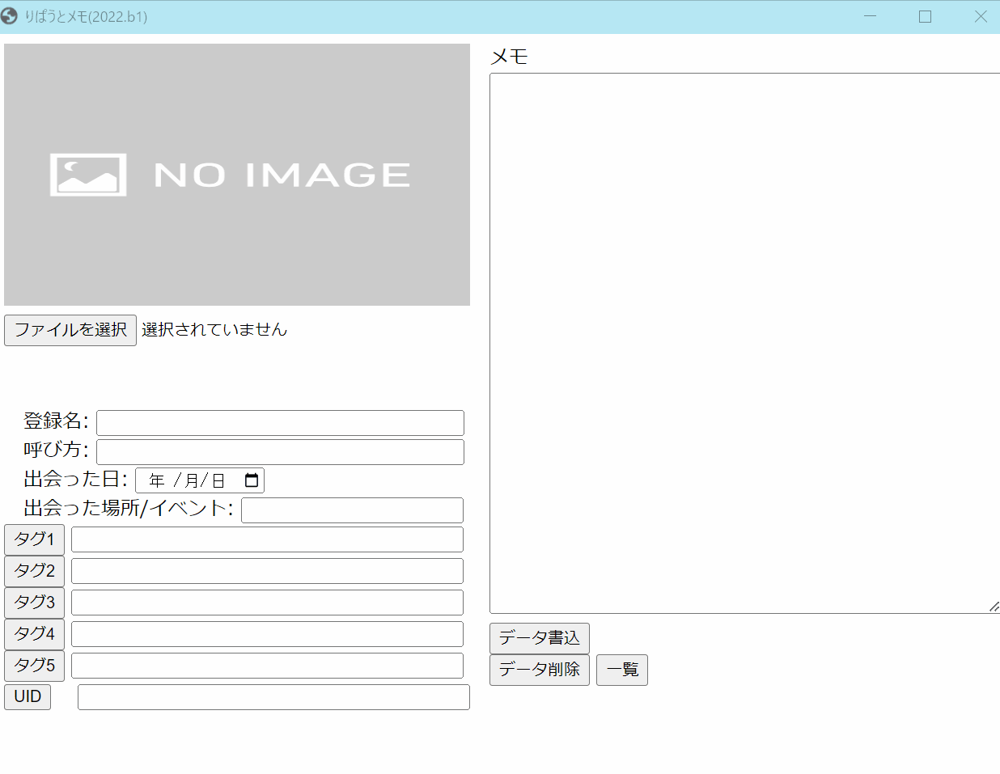

Ripauto Memo
====

[日本語はこちら](readme_jp.md)

## Overview
It is a database management system that you met friends in VRChat.

## Description
This is a imitation of the notebook that VRChat user [りぱうと（ripauto）](https://vrchat.com/home/user/usr_990e1d41-3fdb-49ae-a3a0-16b145cb7c02) uses on a regular basis. Sometimes, they remember friend by the notebook that they met friends, for example date, name and simple memo. 

Are there situations when you meet a lot of people and you forget when/where/who/what you did and have trouble having a conversation? In fact, I met the person with the yellow nameplate and we both asked each other, "Where did we meet?" and we soon parted ways. "Is there anyone like that?"　You have a wonderful memory! ;->

Hopefully, the conversation between you and friends will last forever.

## Demo

## Requirement
- OS: Windows 10 / 11 (64 bit)
- Browser: Chrome

## Usage
1. [Download latest version zip file](https://github.com/OptimisticPessimist/RipautoMemo/releases) and unzip
2. run `ripauto_memo.exe`

We want to support multilingual include English, Chinese(簡体字/繁体字), Korean, and so on. Just a moment please.

## Licence
The MIT License
Copyright © 2022 OptimisticPessimist

Permission is hereby granted, free of charge, to any person obtaining a copy of this software and associated documentation files (the "Software"), to deal in the Software without restriction, including without limitation the rights to use, copy, modify, merge, publish, distribute, sublicense, and/or sell copies of the Software, and to permit persons to whom the Software is furnished to do so, subject to the following conditions:

The above copyright notice and this permission notice shall be included in all copies or substantial portions of the Software.

THE SOFTWARE IS PROVIDED "AS IS", WITHOUT WARRANTY OF ANY KIND, EXPRESS OR IMPLIED, INCLUDING BUT NOT LIMITED TO THE WARRANTIES OF MERCHANTABILITY, FITNESS FOR A PARTICULAR PURPOSE AND NONINFRINGEMENT. IN NO EVENT SHALL THE AUTHORS OR COPYRIGHT HOLDERS BE LIABLE FOR ANY CLAIM, DAMAGES OR OTHER LIABILITY, WHETHER IN AN ACTION OF CONTRACT, TORT OR OTHERWISE, ARISING FROM, OUT OF OR IN CONNECTION WITH THE SOFTWARE OR THE USE OR OTHER DEALINGS IN THE SOFTWARE.

## Author
[key-chan](https://twitter.com/HilariPessimist)
