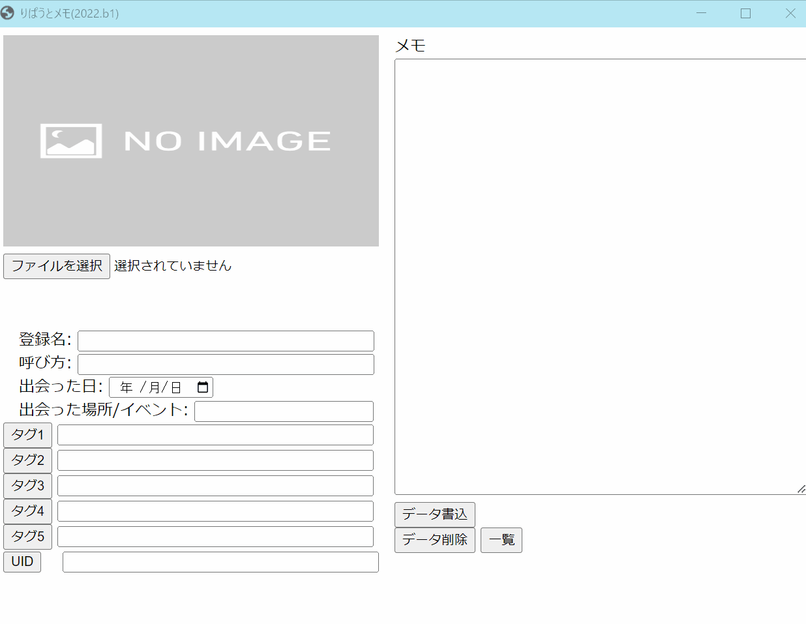

りぱうとメモ
====

## 概要
VRChatで出会ったフレンドを記録するデータベース管理ソフトです。  
SteamVRオーバーレイ対応予定です。

## もっと詳しく
VRChatユーザーの[りぱうと（ripauto）](https://vrchat.com/home/user/usr_990e1d41-3fdb-49ae-a3a0-16b145cb7c02)さんが普段使っているフレンド記録ノートにインスパイアを受けて製作しました。  
りぱうとさんは出会ったユーザーの日付と名前をノートにメモし、時々見返してはフレンドとの記憶を思い出すそうです。  

VRChatでたくさんの人と出会うと、いつ/どこで/誰と/どんなことをしたか忘れてしまい、会話に困る場面はありませんか？  
事実、私は黄色ネームプレートの人とお互いに「どこで出会いましたっけ？」という話をしてすぐ別れました。  
そんな奴はおらん？　素晴らしい記憶力ですね！

願わくば、あなたとフレンドとの会話が永遠に続きますように。

## デモ

## システム要件
- OS: Windows 10 / 11 (64 bit)
- ブラウザ: Chrome

Macで動作させたい場合は、Python 3.10 をインストールした後、GitHubから `git clone` して `ripauto_memo.py` を起動させてください。

## 注意点
- `ripauto_memo.exe` の**初回起動時に自動生成される `photo` フォルダに登録したいフレンドの画像を保存してください。**
- `ripauto_memo.exe` でフレンドを登録したときに自動生成される `ripauto_memo.sqlite3` には、このプログラムで扱うフレンド情報のデータベースが保管されているため、誤って消さないでください。
  - `ripauto_memo.sqlite3` を削除することで、データベースを最初から作成できます。
  - アプリケーションをアップデートする前に、 `ripauto_memo.sqlite3` と `photo` フォルダを退避し、ファイル解凍後に新しいフォルダ内へ再配置することでデータが引き継がれます。
- `ripauto_memo.exe` も含めて、すべてのフォルダ/ファイルは位置と内容を変更すると動作を保証できません
  - 修正点や更新案があれば、GitHubリポジトリのIssueに書き込みしてください。Twitterへのリプライは気付かないことがあります。

## 使用方法
1. [最新版をダウンロードし](https://github.com/OptimisticPessimist/RipautoMemo/tags)解凍する。ドット記号の後にbが付いているバージョンはβ版なので、安定版の選択を推奨します。  
   バージョン番号の付け方は `西暦.リリース番号` となっている。西暦の数が大きいグループの中で、リリース番号が一番大きいバージョンが最新安定版です。
2. (`未登録の全フレンドを登録する`機能を使う場合)  
   Google Chromeを起動し、ヘルプから「Chromeについて」を選択する。  
   バージョン番号を確認し、[ChromeDriverの一覧から最初の数字3桁が一致する物を選ぶ](https://chromedriver.chromium.org/downloads)。  
   Windowsでは、`win32.zip` と書かれているものをダウンロードし、解凍したフォルダの中にある `chromedriver.exe` を `ripauto_memo` フォルダの中に入れる。(`photo`フォルダと同じフォルダ内)
3. `ripauto_memo`フォルダ内の`ripauto_memo.exe`ファイルを実行する。
4. フレンドを登録する場合
   1. 画面を表示したタイミングで、通常VRChatのログが保存されている隠しフォルダ `C:\Users\{USER_NAME}\AppData\LocalLow\VRChat\VRChat` から隠しファイルであるログファイル(`output_log_HH-MM-SS.txt`)を自動的に探し、フレンドを登録します。  
      このログファイルは翌日以降にVRChatを起動した段階で自動的に削除される仕様のため、フレンド申請を受け取った日の最後に当アプリを起動させることを推奨します。
   2. 「出会った日」を含む、必要な項目を入力してください。出会った日が空欄だとデータが登録できません。それ以外の項目は空でも構いません。    
       `UID` を記録することで、フレンド情報画面の `UID` ボタンをクリックすると該当のフレンドのVRChat Homeのプロフィールページを開くことができます。
       `UID` は[VRChat Home](https://vrchat.com/home/)から該当のフレンドを選択し、URLの `usr_`を含む英数字部分を指します。  
   3. `データ書込` ボタンをクリックすることで、DBに登録されます。
   4. `データ削除` ボタンをクリックすることで、表示されているフレンドのデータを削除します。
   5. `一覧` ボタンを押下することで、検索画面に移行します。
5. フレンドを検索する場合
   1. 画面上部にある入力欄を空欄の状態で `名前で検索` ボタンをクリックすると、登録された全フレンドが登録順に表示されます。
   2. 入力欄に文字がある状態で `名前で検索` ボタンをクリックすると、その文字列を含んだユーザーネームとニックネームを持つフレンドを一覧表示します。
   3. 入力欄に文字がある状態で `タグで検索` ボタンをクリックすると、その文字列を含んだタグを含むフレンドを一覧表示します。
   4. フレンドの情報を見たいときは、フレンドの画像をクリックしてください。
   5. `未登録の全フレンドを登録する` ボタンをクリックすると、現在登録されているフレンドと同一のUIDを持たないフレンドをVRChat Homeから取得して保存します。  
      この作業はフレンドの人数にもよりますが、数分から十数分必要です。ブラウザが起動するので、VRChatのユーザー名とパスワードを順に入力し、ブラウザが消えるまでお待ちください。  
      このボタンで登録したフレンドは、自動的にタグが `auto-writing` となり、出会った日が `2017年2月1日` になります。適宜修正してください。
6. 終了時は画面右上の×ボタンを押下してください。

## ライセンス
The MIT License
Copyright © 2022 OptimisticPessimist

以下に定める条件に従い、本ソフトウェアおよび関連文書のファイル（以下「ソフトウェア」）の複製を取得するすべての人に対し、ソフトウェアを無制限に扱うことを無償で許可します。これには、ソフトウェアの複製を使用、複写、変更、結合、掲載、頒布、サブライセンス、および/または販売する権利、およびソフトウェアを提供する相手に同じことを許可する権利も無制限に含まれます。

上記の著作権表示および本許諾表示を、ソフトウェアのすべての複製または重要な部分に記載するものとします。

ソフトウェアは「現状のまま」で、明示であるか暗黙であるかを問わず、何らの保証もなく提供されます。ここでいう保証とは、商品性、特定の目的への適合性、および権利非侵害についての保証も含みますが、それに限定されるものではありません。 作者または著作権者は、契約行為、不法行為、またはそれ以外であろうと、ソフトウェアに起因または関連し、あるいはソフトウェアの使用またはその他の扱いによって生じる一切の請求、損害、その他の義務について何らの責任も負わないものとします。

## 著作者
[key-chan](https://twitter.com/HilariPessimist) new.folder.booth@gmail.com
